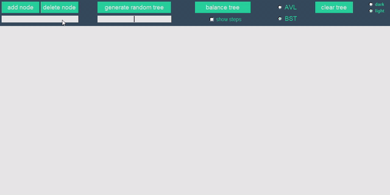
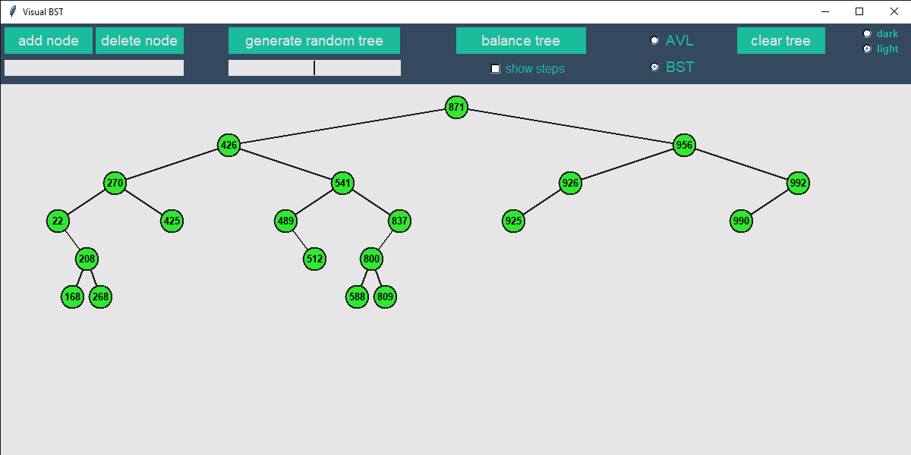
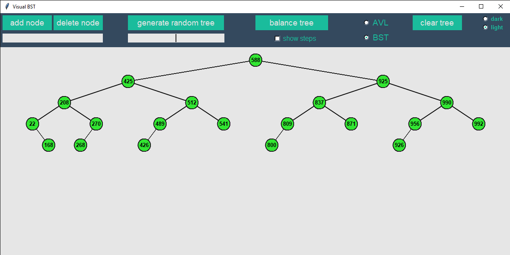
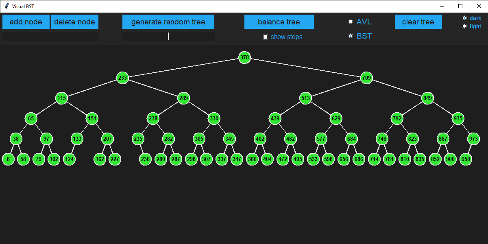

# Interactive Visual Binary Search Tree
Interactive and Visual Binary Search Tree implemented using Python and Tkinter

In this project, I create a user interface for an interactive visual representation of a binary search tree. A GIF is attached below which gives a demo of the features that are available.



## About The Project
A Binary Search Tree **(BST)** is a rooted binary tree whose nodes contain a **key** which is generally associated to some data (**e.g** in a phone directory, the name can be the key while the phone number is the associated data) and the BST is responsible for mainting the keys in a sorted order. Each node also links to 2 subtrees commonly called the **left** and **right subtree** and they satisfy the **binary search** property, which states that the keys in every node of the left subtree is smaller than the key in the root node and the keys in every node of the right subtree is greater that the key in the root node. 

One of the main advantages of a BST is that the **time complexity** for the basic operations of a data structure (adding, deleting and searching for elements) all require at worst **linear time** by making ***O(n)*** comparisons, where ***n*** is the number of nodes in the tree. The worst case is achieved by adding elements to the BST in ascending or descending order, in this case the BST is not a tree but rather a **path**. Although this situation can be improved by balancing the tree which reduces the time complexity to **logarithmic time** by making ***O(log n)*** comparisons. (A balanced BST is a BST where the heights of the two subtrees of every node differ by at most one) 

A variation of the BST is the **AVL tree** which can be considered as a self-balancing BST. In other words, it is a BST which balances itself with every new entry or every deleted entry while maintaining the binary search invariant.

## Getting Started

### Prerequisites
* The program was created using **Python3.7**
* The UI was created using **Tkinter** (preinstalled with Python)

### Installation
To install the Interactive Visual Binary Search Tree app, clone this repository using the following command:
```
git clone https://github.com/kousheekc/Interactive-Visual-Binary-Search-Tree
```

## Usage
To run the app, open a terminal and navigate to the folder you just cloned and run the following command:
```
python3 -m app
```
Once the app is running the interface is self-explanatory. The features of the app are listed below.

### Features:
* **Add and delete** individual nodes from the BST
* **Generate a random BST** of a specific size
* **Balance** the BST (with the *show steps* option selected the recursive steps of the balancing process are shown)
* **AVL tree or BST** (with the AVL option selected, the tree self balances everytime a node is added or deleted)
* **A visual representation** of the tree that updates in realtime.
* And finally no UI is complete without an inbuilt **dark color scheme** :smiley:


## License
Distributed under the MIT License. See [LICENSE](LICENSE) for more information.

## Contact
Kousheek Chakraborty - kousheekc@gmail.com

Project Link: [https://github.com/kousheekc/Interactive-Visual-Binary-Search-Tree](https://github.com/kousheekc/Interactive-Visual-Binary-Search-Tree)


### Random BST



### Balanced BST




### Dark mode


